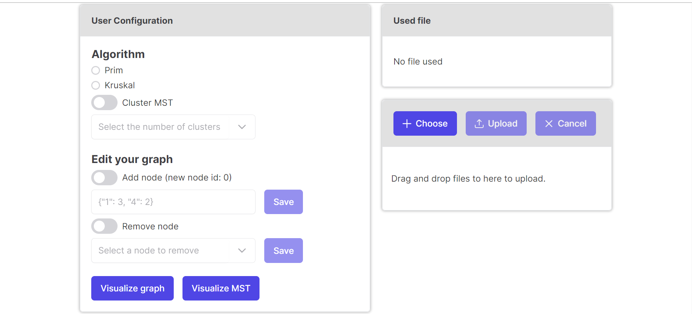
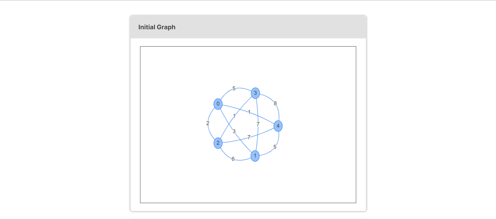
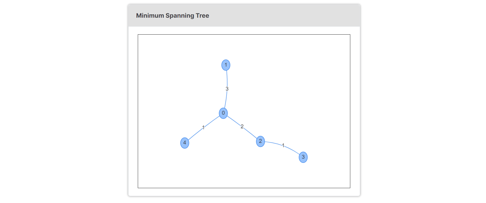

## Description

A minimum spanning tree (MST) or minimum weight spanning tree is a subset of the edges of a connected, edge-weighted undirected graph that connects all the vertices together, without any cycles and with the minimum possible total edge weight. That is, it is a spanning tree whose sum of edge weights is as small as possible.

This project aims to generate a minimum spanning tree from a graph using two algorithms: Prim's and Kruskal's. Prim's algorithm works by selecting a node from the graph and iterating through the neighbor of the previously selected nodes to get a node with the minimum weight. Kruskal's algorithm works by selecting the smallest edges first and continuously adding it to the tree until all nodes are inserted to the tree.





## How to Use

1. Run locally or click [here](https://mst-algorithm-visualization.vercel.app/) to run remotely
2. Write adjacency matrix in a file with `.txt` extension.
   - Adjacency matrix is a matrix `M` such that `M[i][j]` represents the weight/distance between node i and node j and if `M[i][j] == 0`, it means there's no edge between node i and node j
   - `M[i][i]` must be 0
   - The adjacency matrix must be square (i.e. number of rows = number of columns)
   - The adjacency matrix must be symmetrical (i.e. `M[i][j] == M[j][i]`)
   - Here's an example of a valid adjacency matrix
     ```
     0 3 2 5 1
     3 0 6 7 5
     2 6 0 1 7
     5 7 1 0 8
     1 5 7 8 0
     ```
3. Select the file by clicking 'Choose' button or by drag-and-dropping the file
4. Upload the file by clicking 'Upload' button
5. Select one of the algorithm (Prim or Kruskal)
6. [Optional] If you want the minimum spanning tree to have several clusters, check the 'Cluster MST' toggle and select how many clusters you want in the dropdown below the toggle
7. [Optional] If you want to add a new node to the graph, check the 'Add node' toggle and insert the neighbor information in the input box below the toggle with JSON format like this.
   ```
   {"neighborNodeId": weight, "anotherNeighborNodeId": weight}
   ```
   In this example below, the new node will be adjacent to node 1 with weight 3 and node 4 with weight 2. The new node will not be adjacent to any other nodes
   ```
   {"1": 3, "4": 2}
   ```
   You can also insert empty JSON if the new node will not be adjacent to any node
   ```
   {}
   ```
   Click 'Save' button next to the input box
8. [Optional] If you want to remove a node from the graph, check the 'Remove node' toggle and select a node to remove in the dropdown below the toggle. Click 'save' button next to the dropdown
9. To visualize the initial graph, click 'Visualize graph' button. The initial graph will appear inside its container
10. To visualize the minimum spanning tree, click 'Visualize MST' button. The minimum spanning tree will appear inside its container

## How to Run Locally

1. Clone this repository

   ```bash
   git clone https://github.com/haziqam/MST-algorithm-visualization.git
   ```

2. Navigate to the root directory of this project

   ```bash
   cd MST-algorithm-visualization
   ```

3. Install dependencies

   ```
   npm install
   ```

4. Run the development server:

   ```
   npm run dev
   ```

5. Open [http://localhost:3000](http://localhost:3000) with your browser to see the result.

## Technologies used

- [Next.js](https://nextjs.org/) as project framework
- [PrimeReact](https://primereact.org/) as UI component library
- [Vis.js](https://visjs.org/) for graph visualization
- [Vercel](https://vercel.com/) for deployment
- CSS for custom styling

## Author

- Haziq Abiyyu Mahdy (13521170)
